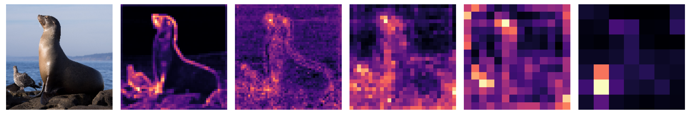
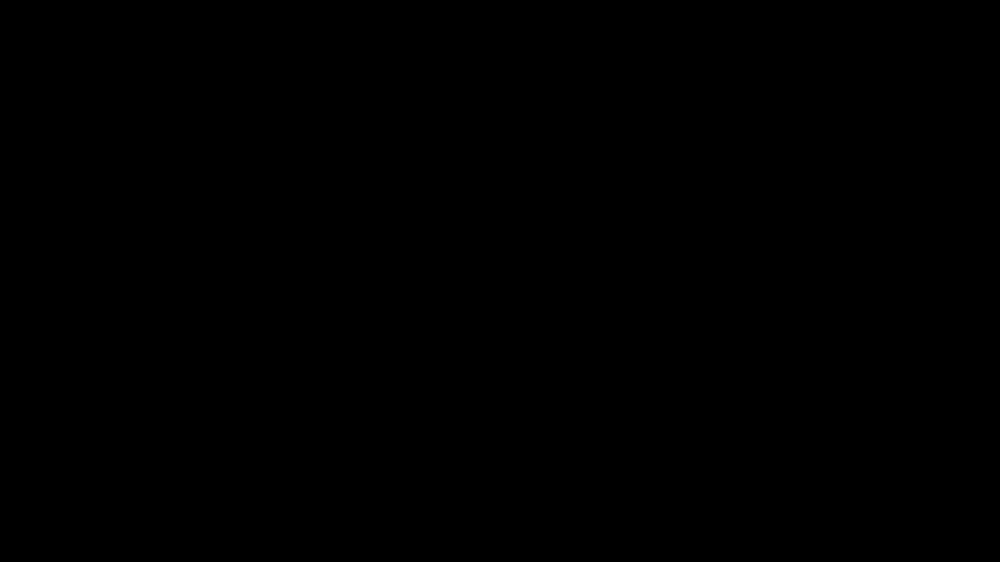
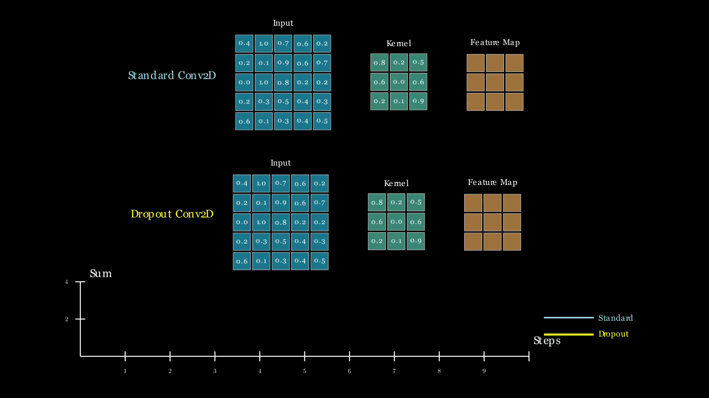

# CNN Fundamentals & Layers

## 1. Why use CNNs over MLPs?

In a standard Multilayer Perceptron, every input and output neuron is connected between layers. For a (224, 224, 3) image:
- **Input shape**: $224\times 224\times 3 = (150528, 1)$
- **Parameters**: Single hidden layer with W: (1, 100) will have ~15 million parameters

This is computationally expensive and ignores **spatial hierarchy** found within images. CNNs solve this by:
1. **Spatial Connectivity**: Learn parameters of a kernel, extract information from a window of pixels: **filter size**
2. **Sharing Weights**: Using the same kernel across the entire image, reducing the parameter count: **parameter count**

The **Search** for Filters: In signal processing section, filter is defined (e.g. blur). In CNNs, the network learns filter weights through backpropagation. Effectively, it <ins>searches</ins> for the optimal filter for that case.

---

## 2. Layers of a CNN

### 2.1 **Feature Hierarchy**: 
How layers act throughout the network _**generally**_.
* **Early Layers**: Low-level feature extractors, inherent information about the task will accumulate here (edge detection, colours, core information about input image)
* **Mid Layers**: Combined edge information from `early layers`. Can contain simple textures, shapes (e.g. circles, rectangles, open ended shapes)
* **Late Layers**: Shapes into concepts (e.g. car, cat, dog, eyes, wheels, etc.) These are more abstract and will most likely be task-specific.

**$$\text{edges} \Rightarrow \text{shapes} \Rightarrow \text{concepts}$$**

We will check this relation in more detail with the grad visualizations in later sections.

### 2.2 Building Blocks
* Convolution Layer (2D, 3D, Depthwise Separable, UpConv, etc.)
* Pooling Layer (max, avg)
* Activation Layer (ReLU)
* Regularization Layer (BatchNorm, Dropout)
* Flatten Layer

---

## 3. Convolution Layers

In the [convolution markdown](CONVOLUTION.md), sliding window operation and how it is calculated are covered on the 1D samples.

### 3.1 **The Local Dot Product**

For a single position of a **$f\times f$** kernel **$F$**, sliding over an image **$I$**, the output value **$Y$** at position is:

**$$Y = \sum_{i=1}^{f} \sum_{j=1}^{f} (I_{i,j} \cdot F_{i,j}) + b$$**
- **$I_{i,j}$**: Pixel magnitude at $(i, j)$
- **$F_{i,j}$**: Weight at $(i, j)$
- **$b$**: bias term

<p align="center">
  
</p>

### 3.2 **Handling Multi Channel**
Images are usually RGB, meaning a kernel in the network should also be covering a **3D volume**.
- **Input**: $H\times W \times 3$
- **Kernel**: $f\times f\times 3$ (channels must match the input)
- **Calculation**: Dot product, calculated across all channels simultaneously and summed to a single value for $(i, j, c)$

### 3.3 **Backprop**

For those who are interested, there is a neat explanation on backprop through convolution in [John Lambert's explanation](https://johnwlambert.github.io/conv-backprop/#backprop-throughconv-to-weights). 

### 3.4 **Training Loop**

The weight update follows the standard:

**$$W_{t+1} = W_t - \eta \cdot \frac{\delta L}{\delta W}$$**

- **$\eta$**: Learning rate
- **$\frac{\delta L}{\delta W}$**: Backward convolution result

### 3.5 **Hyperparameters**
- **Filter Size ($f$)**: Commonly $3\times 3$ and $5\times 5$
- **Stride ($s$)**: How much the kernel moves at each step
- **Padding ($p$)**: Adding zeros around the input to control output size (e.g. 'same' vs 'valid')
- **Number of Filters ($n$)**: Determines the depth of the output feature map (e.g. 32, 64, 128)

**Shape formula**
Given input dimensions $(H_{in}, W_{in}, C_{in})$, to calculate output dimensions $(H_{out}, W_{out}, C_{out})$:
**$$H_{out} = \left\lfloor \frac{H_{in} - f + 2p}{s} \right\rfloor + 1$$**
**$$W_{out} = \left\lfloor \frac{W_{in} - f + 2p}{s} \right\rfloor + 1$$**
**$$C_{out} = n$$**

**Simple Torch Example**
Code block on defining a layer and calculate the output shape using PyTorch:
```py
import torch
import torch.nn as nn

# input shape: (batch_size, channels, height, width) -> !torch works channel first
input_tensor = torch.randn(1, 3, 224, 224)

# conv layer definition
conv_layer = nn.Conv2d(
    in_channels=input_tensor.shape[1], out_channels=64, kernel_size=3, stride=2, padding=1
    )
# f=3, s=2, p=1, c=64

# calculate output
out = conv_layer(input_tensor)
print(f"input shape: {input_tensor.shape}") # (1, 3, 224, 224)
print(f"output shape: {out.shape}")         # (1, 64, 112, 112)
```
Math check: $H_{out}=\left\lfloor\frac{224 - 3 + (2 \times 1)}{2}\right\rfloor + 1 \Rightarrow H_{out}=112$
$W_{out}$ is same and $C_{out}=64$ as defined in the layer.


---

## 4. Grad Map Visualizations
The Grad CAM weight $\omega_k^c$ for a specific class $c$ and feature map $f$ is calculated by taking the average of the gradients over the $W, H$:

**$$\omega_k^c = \frac{1}{Z} \sum_i\sum_j{\frac{\delta Y^c}{\delta A_{ij}^k}}$$**
where:
- **$Y^c$** is score for class $c$ (before softmax)
- **$A^k$** is the activation of the $k$-th feature map.
- **$Z$** is the number of pixels in thne feature map. ($W\times H$)

You can define a hook function to run each time grad is updated. In forward loop, `register_hook` method of `torch.Tensor` should be used to add your custom function to it.
[gradmap script](gradmap.py)

<p align="center">
  
</p>

Could also play with [tensorflow playground - nn visualizer](https://playground.tensorflow.org) or demos from [convnetjs from Andrej Karpathy](https://cs.stanford.edu/people/karpathy/convnetjs/).

Would also suggest checking out [distill's feature visualization](https://distill.pub/2017/feature-visualization/) as all of their work provide great context and intuition on related topics. Just take a pause and ponder around the other pages in the website, they are insightful.

```py
class NN(nn.Module):
    def __init__(self):
        ...
        self.gradients = None
        self.activations = None
        ...
    
    def activations_hook(self, grad):
        self.gradients = grad

    def forward(self, x):
        ...
        # register hook on last layer
        if x.requires_grad:
            h = x.register_hook(self.activations_hook)  # important for torch to track grad
        self.activations = x

        ...
```

## 5. Pooling Layers

Pooling layers provide `translation invariance` meaning if an object in the image shifts by an arbitrary amount, pooling helps the network still recognize it.
- **Max Pooling**: Extracts the highest signal in the window. $$Y = \max_{i,j} I_{i,j}$$
- **Average Pooling**: Extracts a smoothed summary of the region. $$Y = \frac{1}{f^2} \sum_{i,j} I_{i,j}$$

<p align="center">
  
</p>

---

## 6. Regularization Layers

On a daily basis, models with millions, billions of parameters get trained daily and are prone to overfitting. Regularization layers introduce constraints, noise or you might call, a disturbance to the learning process in hopes to prevent this.

### 6.1 Dropout

It is a simple yet powerful regularization. During training, some set of neurons are dropped (zeroed out) with a probability $p$.
- Prevents network to rely on only some neurons and nothing else, distributing "learned weights"
- **Interesting practice**: remaninig neurons are scaled with $\frac{1}{1-p}$ to maintain the total magnitude of the activation.
- **Inference**: Dropout is turned off at test.

<p align="center">
  
</p>

```py
import torch
import torch.nn as nn

dropout = nn.Dropout(p=0.5)
input_tensor = torch.randn(1, 10)

# training
output_train = dropout(input_tensor)
print(f"train out: {output_train}")
# check how many neurons are dropped
print(f"how many zeroes: {(output_train == 0).sum()}")  # an arbitrary number between 0 and 10, likely around 5 (p=0.5)

dropout.eval()  # same as model.eval(), applies to all Module's within
output_eval = dropout(input_tensor)
print(f"eval out: {output_eval}")  # check the difference
print(f"how many zeroes: {(output_eval == 0).sum()}")  # should be 0 in eval mode.
```

### 6.2 Batch Normalization

Batch Normalization (BatchNorm) addresses the **Covariate Shift problem**, where the distribution of input changes during training as the parameters of previous layers change. 
- Normalizes the output of previous layer by normalizing with the batch mean and variance
- **Warning**: Heavily dependant on the batch size, lower batch sizes will lead to noisier estimates, sometimes interrupting learning.
- **Warning 2**: As your test set change, distribution of the data can too, which can lead to breaking results. In these cases, it would be better to use non-batch dependant statistics (e.g. layer normalization, group normalization).

Transformation: For a mini-batch  $\mathcal{B} = \{x_1, \dots, x_m\}$:

1. **Calculate mean**: $\mu_{\mathcal{B}} = \frac{1}{m} \sum_{i=1}^{m} x_i$
2. **Calculate variance**: $\sigma_{\mathcal{B}}^2 = \frac{1}{m} \sum_{i=1}^{m} (x_i - \mu_{\mathcal{B}})^2$
3. **Normalize**: $\hat{x}_i = \frac{x_i - \mu_{\mathcal{B}}}{\sqrt{\sigma_{\mathcal{B}}^2 + \epsilon}}$
4. **Scale and Shift**: $y_i = \gamma \hat{x}_i + \beta$ (where $\gamma$ and $\beta$ are learnable parameters)
* $\epsilon$: small constant for zero division / numerical stability
* $\gamma$ and $\beta$: Learnable parameters that allow the network to restore the original distribution by learning mean and variance.

<p align="center">
  
</p>

```py
import torch
import torch.nn as nn

bn = nn.BatchNorm2d(num_features=64)  # num_channels of previous layer output must match num_features
input_tensor = torch.randn(1, 64, 32, 32)
output_tensor = bn(input_tensor)
print(output_tensor.shape)  # torch.Size([1, 64, 32, 32])
# can also check the old and new mean and variance
print(f"input mean: {input_tensor.mean().item():.4f}, input var: {input_tensor.var().item():.4f}")
print(f"output mean: {output_tensor.mean().item():.4f}, output var: {output_tensor.var().item():.4f}")
```

---

## 7. Activation Layers
In the previous weeks, we discussed the importance of non-linearity in the network. With it, networks can approximate high order functions and learn complex patterns.

### 7.1 ReLU
Rectified Linear Unit (ReLU) is the most commonly used activation function. It is defined as:
**$$f(x) = \max(0, x)$$**

Has the following characteristics:
- **Sparsity**: Clamping negative values to 0 leads to sparse activations.
- **Unbounded Output**: Output is not capped at a value, allowing for gradients to flow without scale issues.

```py
import torch
import torch.nn as nn

relu = nn.ReLU()  # use it instead of manual definition for efficiency or define it as nn.Module
input_tensor = torch.tensor([-1.0, 0.0, 1.0, 2.0])
output_tensor = relu(input_tensor)
print(output_tensor)  # tensor([0., 0., 1., 2.])
```

### 7.2 Leaky ReLU
Designed to fix where neurons get stuck at zero and learning stops, with a small change in ReLU definition:
**$$f(x) = \begin{cases} x & \text{if } x > 0 \\ \alpha x & \text{if } x \leq 0 \end{cases}$$**
Where $\alpha$ is a small constant that allows a small gradient pass.

### 7.3 Sigmoid
**$$f(x) = \frac{1}{1 + e^{-x}}$$**
- Output range: (0, 1)
- Used for binary classification tasks, mostly at the end of the network to obtain class probabilities.

### 7.4 Tanh
**$$f(x) = \frac{e^x - e^{-x}}{e^x + e^{-x}}$$**
- Output range: (-1, 1)
- Similar to sigmoid, but zero-centered. Makes it easier for optimization in some cases.

### 7.5 Softmax
**$$f(x_i) = \frac{e^{x_i}}{\sum_{j} e^{x_j}}$$**
- Multi-class version of sigmoid.
- Instead, outputs a vector of probabilities that sum to 1.

### Overview

| Activation | Range | Usage in CNNs |
| :--- | :--- | :--- |
| **ReLU** | $[0, \infty)$ | Standard for hidden layers. |
| **Leaky ReLU** | $(-\infty, \infty)$ | Used if neurons get stuck at 0. |
| **Sigmoid** | $(0, 1)$ | Binary classification output only. |
| **Softmax** | $(0, 1)$ | Multi-class classification output only. |

<p align="center">
  
</p>

---

## 8. Flatten Layer
CNNs produce multi-dimensional feature maps as suggested before. To connect these with fully connected MLPs, `flatten layer` is used. 
It reshapes the input tensor of $(B, C, H, W) \rightarrow (B, C \times H \times W)$
Considering the CNNs are designed as feature extractors, flattening allows to pass diluted/densed down features to be passed through an MLP.
```py
import torch
import torch.nn as nn

flatten = nn.Flatten()
input_tensor = torch.randn(4, 3, 32, 32)  # 4 is the batch size here
output_tensor = flatten(input_tensor)
print(output_tensor.shape)  # torch.Size([4, 3 * 32 * 32]) -> torch.Size([4, 3072])
```

---

## 9. Other Layers
Although we will not be covering these in detail due to time constraints, here are some other layers you might like to check out. These are also used in other task types and related architecture solutions.

- **UpConv (Transposed Convolution)**: Used in generative models and segmentation tasks (be careful, shape operations are inverse of conv here)
- **Depthwise Separable Convolution**: Used in MobileNets for efficiency, separates spatial and channel-wise convolutions.
- **Dilated Convolution**: Expands the receptive field without increasing parameters, used in segmentation and generative models.


Little break here