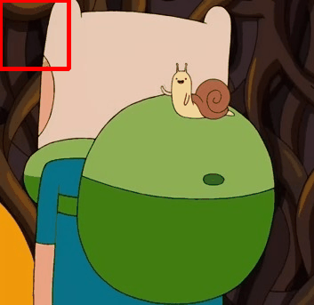
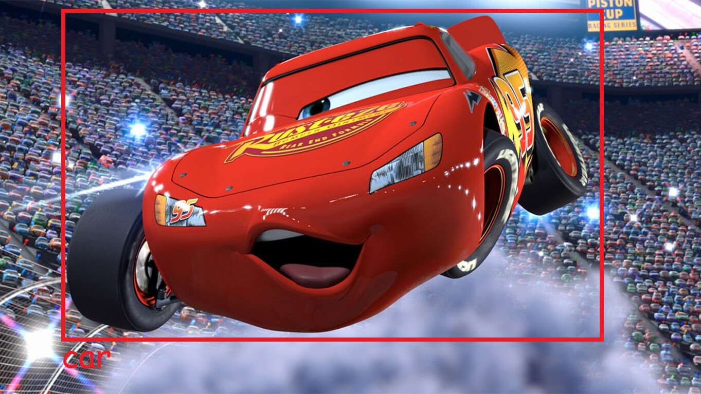
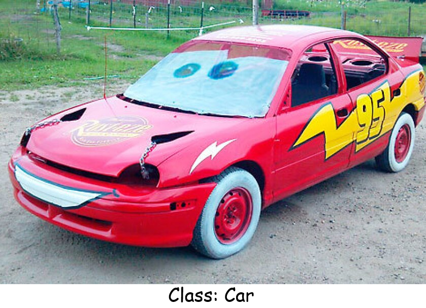
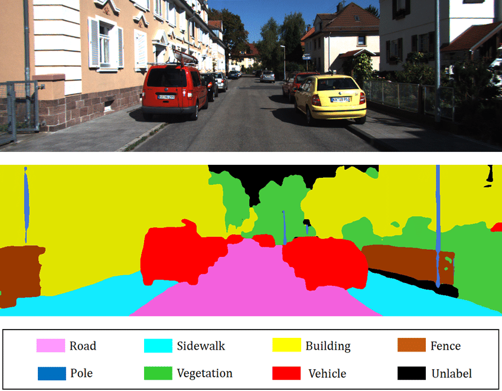
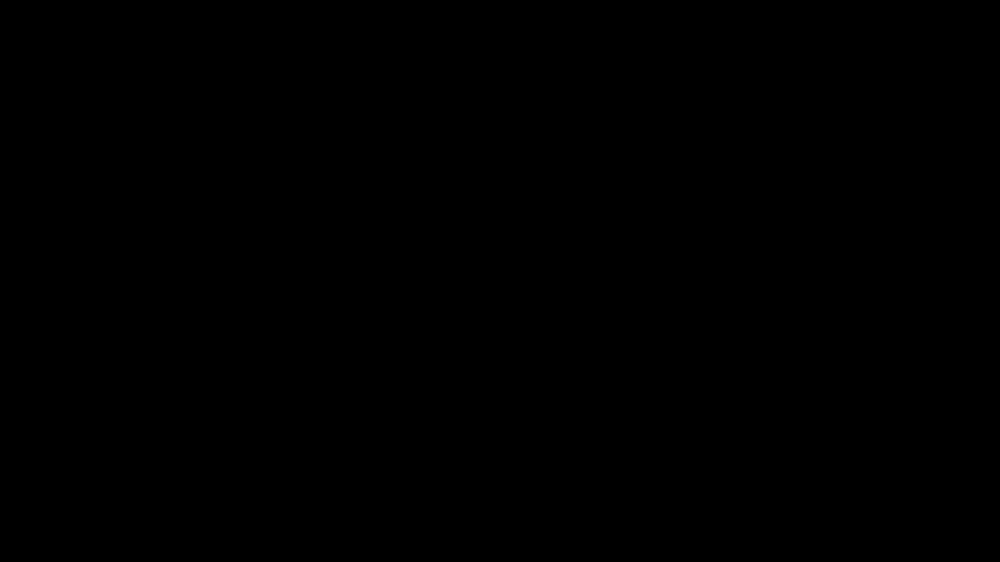
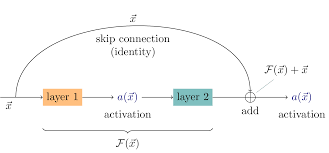
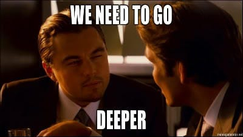
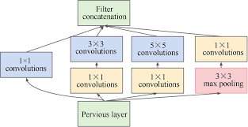
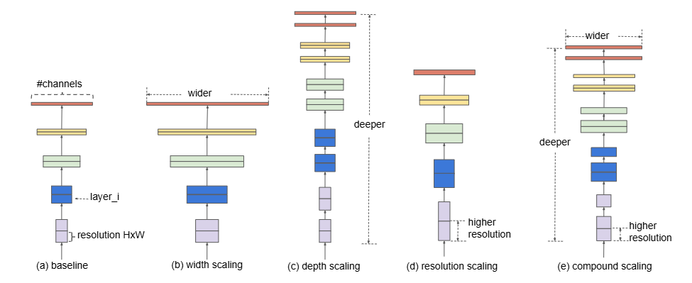
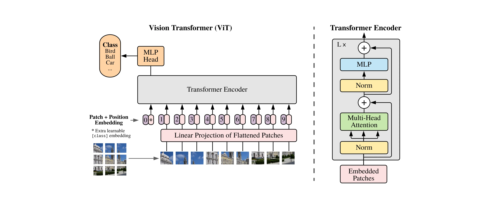

# Generic Vision Tasks & Topics

## 1. **Classification**
- **Goal**: Assign single label to an entire image
- **Output**: Vector of class probabilities (sigmoid, softmax)
- **Key Concept**: Reduce spatial dimensions $(H,W)$ to $(1,)$ via layers mentioned in [CNN markdown](CNN.md#3-convolution-layers), ending in a Fully Connected layer.

```py
class ClassifierHead(nn.Module):
    def __init__(self, in_features, num_classes):
        super().__init__()
        self.fc = nn.Linear(in_features, num_classes)
    
    def forward(self, x):
        # shape: (batch, features) -> after flattening
        return self.fc(x)  # logits
```

---

## 2. **Object Detection**
- **Goal**: Find objects in an image and localize where they are with coordinates
- **Output**: class labels + bounding box coordinates $(x, y, w, h)$ <ins>disclaimer</ins>: format can vary
- **Key Concept**: Multi-task learning. Network has two heads: one for classification and one for regression (bounding box detection).

<p align="center">
  
</p>

**Detection Vector (output example)**: For a single prediction (once cell in the prediction grid), output is the vector $y$ of dimension $(C+5)$ where $C$ is the number of classes.

$$
y = 
\begin{bmatrix} p_c \\ b_x \\ b_y \\ b_h \\ b_w \\
c_1 \\ \vdots \\ c_n
\end{bmatrix}
$$

- **$p_c$**: probability of object existing in the cell (confidence)
- **$b_x, b_y$**: coordinates of the bounding box center relative to grid cell
- **$b_h, b_w$**: height and width of the bounding box often relative to the whole image or anchor box
- **$c_1, \ldots, c_n$**: class probabilities for each class. These are conditional probabilities $P(\hat{c}_i|c_i)$, $\hat{c}_i$ being the predicted and $c_i$ being the true class.

**Loss Function**: Loss is a weighted sum of three error types:
$L = \lambda_{\text{coord}} \sum (b - \hat{b})^2 + \sum (p_c - \hat{p}_c)^2 + \sum (c - \hat{c})^2$

_(Localization Loss + Confidence Loss + Classification Loss)_


Actually there are tons of processes here you will dive on the next week. For now, just throwing function names to check, for the ones who are interested:
- Letterboxing
- IoU (Intersection over Union)
- NMS (Non-Max Suppression)
- Anchor Boxes
- Grid Division (patching)
- mAP (mean Average Precision)
- Focal Loss, IoU loss types (loss functions used in detection)

**<p align="center">Finally, results <br><br>And some other results<br></p>**
<p align="center"></p>

---

## 3. **Segmentation**

- **Goal**: Pixel-wise classification of the image.
- **Output**: Mask of shape $(H, W, num\_classes)$ for each image.
- **Key Concept**: Instead of going to $(num\_classes, )$, spatial dimensions are preserved at the output. 
Requires an Encoder-Decoder structure:
    - Encoder: Behaviour is similar to a classifier, classification weights can be used as pre-trained.
    - Decoder: Consists of some type of upsampling layer to reconstruct spatial dimensions. To decode the features into something similar to the label image.

- **Types**:
    - Semantic Segmentation: Basic segmentation, classify each pixel into a class.
    - Instance Segmentation: Distinguish between different instances of the same class. A bit like detection in the sense of localizing objects.

Semantic segmentation example:
<p align="center">
  
</p>


---

## 4. **Generative Models && Reconstruction**

Generative models differ much on the architecture as it has been progressing rapidly. However, key concept is that they map latent vectors obtained from a distribution to the image space of the most likelyhood of the data distribution.

- **Goal**:
    - Synthesis: Creating new samples from a learned distribution
    - Reconstruction: Repairing or enhancing existing images (e.g., super-resolution, inpainting)
    - Translation: Converting from one domain to another (e.g., $sketch \rightarrow photo,\text{ } day \rightarrow night$)

- **Key Concept**: Reverse Flow
    1. Transposed Convolution: Learnable upsampling layer
    2. Upsampling + Convolution: Non-learnable upsampling followed by a convolution to update details. Prevents checkerboarded outputs.

- **Architecture Snippet**:
```py
class GeneratorBlock(nn.Module):
    def __init__(self, in_c: int, out_c: int):
        super().__init__()
        self.up = nn.ConvTranspose2d(in_c, out_c, kernel_size=4, stride=2)
        self.bn = nn.BatchNorm2d(out_c)
        self.act = nn.ReLU()
    
    def forward(self, x):
        return self.act(self.bn(self.up(x)))
```

- **Example: Variational AutoEncoders (VAEs)**:
They work by encoding an image into a latent space consisting of a mean and a variance vector. Sampling from the latent space, a decoder generates/constructs new images that align with the task at hand.

**Latent Parameters**
Outputs the parameters of a probability distribution, typically a Gaussian, for given input $x$.
$$q_\phi(z|x) = \mathcal{N}(z;\mu_\phi(x), \sigma^2_\phi(x))$$

- $\mu_\phi(x)$: Mean vector (distribution center)
- $\sigma^2_\phi(x)$: Variance vector (uncertainty)


<p align="center">
  
</p>

This is just a teaser. You could check the [original paper](https://arxiv.org/pdf/1312.6114) for intricate details on the network. Neat solutions!

---


# History of CNNs and Popular Architectures

Chronological walkthrough, how design choices shifted over time.


## 1. LeNet-5 (1998)
-  Contribution: Introduced the standard structure of a CNN: $conv \rightarrow pooling \rightarrow conv \rightarrow FC$
- Context: Solved MNIST digit recognition
- Limitations: Vanishing gradients and usage of average pooling

---

## 2. AlexNet (2012)
- Contribution: Popularized Deep CNNs through its implementation. Utilised GPUs for the first time.
    - ReLU: $f(x)=max(0, x) \rightarrow$ faster training, better convergence
    - Dropout: Regularization to prevent overfitting
    - Architecture: 5 Conv Layers, Large Filters like $11\times11$ and $5\times5$
- Started the trend of deeper networks as well.

---

## 3. VGG (2014)
- Contribution: Simplicity & Depth to improve performance.
- Key Insight: Replacing large filters with stacks of smaller $3\times3$ filters.
    - Showed that two $3\times3$ convolutions have the same receptive field as one $5\times5$, with fewer parameters and more non-linearity. 
    - Formulating: Parameters of $5 \times 5: 25C^2$, parameters of $2\times3\times3: 18C^2$
```py
# vgg block example
nn.Sequential(
    nn.Conv2d(in_ch, out_ch, kernel_size=3, padding=1),
    nn.ReLU(),
    nn.Conv2d(out_ch, out_ch, kernel_size=3, padding=1),
    nn.ReLU(),
    nn.MaxPool2d(kernel_size=2, stride=2)
)
```

---

## 4. ResNet (2015)
- Contribution: Skip Connections (Residual Learning), solved the issue of vanishing gradients in deep networks.
- Key Insight: Learning the residual mapping $F(x)$ instead of the response mapping $H(x)$
    - Network learns modifications to the identity map instead of the entire transformation at a layer. This allows for useless layers' weights to go to 0, while $x$ passing unchanged.
- Equation: $y=F(x, {W_i}) + x$
<p align="center">
  
</p>

```py
# residual block example
class ResidualBlock(nn.Module):
    def __init__(self, in_ch, mid_ch, out_ch):
        super().__init__()
        self.conv1 = nn.Conv2d(in_ch, mid_ch, kernel_size=3, padding=1)
        self.conv2 = nn.Conv2d(mid_ch, out_ch, kernel_size=3, padding=1)

    def forward(self, x):
        identity = x
        out = F.relu(self.conv1(x))
        out = self.conv2(out)
        out += identity  # add the residual connection
        return F.relu(out)
```

---

## 5. Inception / GoogLeNet (2014)

<p align="center">
  
</p>

- Contribution: Width vs Depth
- Key Insight: Instead of choosing between different filter sizes, use them all in parallel and concatenate the results. Allowing the network to learn which filter is the best for each feature.
- 1x1 Convolutions: Used as a `bottleneck` to reduce depth before expensive convolutions happen, saving computation.
```py
class InceptionBlock(nn.Module):
    def __init__(self, in_ch, out_ch):
        super().__init__()
        self.branch1 = nn.Conv2d(in_ch, out_ch, kernel_size=1)
        self.branch3 = nn.Conv2d(in_ch, out_ch, kernel_size=3, padding=1)
        self.branch5 = nn.Conv2d(in_ch, out_ch, kernel_size=5, padding=2)
        self.branch_pool = nn.Sequential(
            nn.MaxPool2d(kernel_size=3, stride=1, padding=1),
            nn.Conv2d(in_ch, out_ch, kernel_size=1)
        )

    def forward(self, x):
        b1 = self.branch1(x)
        b3 = self.branch3(x)
        b5 = self.branch5(x)
        bp = self.branch_pool(x)
        return torch.cat([b1, b3, b5, bp], dim=1)  # concatenate along channel dimension
```

<p align="center">
  
</p>

---

## 6. MobileNet (2017)
- Contribution: Efficiency for Edge Devices
- Key Insight: Depthwise Separable Convolutions
    - Depthwise Conv: Filter per channel (spatial correlation only)
    - Pointwise Conv: $1\times1$ convolution to mix channels (cross-channel correlation)
- Impact: Reduces the number of parameters and FLOPs to train a network with minimal loss in accuracy.

---

## 7. EfficientNet (2019)
- Contribution: Compound Scaling for efficient models on mobile devices.
- Key Insight: Don't just scale depth, width or resolution arbitrarily. Scale all three uniformly using a compound coefficient $\phi$.
    - Depth: $d = \alpha^\phi$
    - Width: $w = \beta^\phi$
    - Resolution: $r = \gamma^\phi$


<p align="center">
  
</p>

---

## 8. Vision Transformers (ViT) (2020)
While this will be thoroughly covered in the following weeks, it would not have been right to not mention it here. As Vision Transformers are currently state-of-the-art in many vision tasks.
- Context: ViT divides images into patches and treats each patch as a token, like a word in a sentence. Although it needs a lot of data to obtain meaningful embeddings, learning how parts of the image relate to itself and each other part creates a powerful relationship model. In my opinion, surpassing the spatial capabilities of CNNs as unconnected patches can still pass information between themselves.

<p align="center">
  
</p>

---

A break again :)
