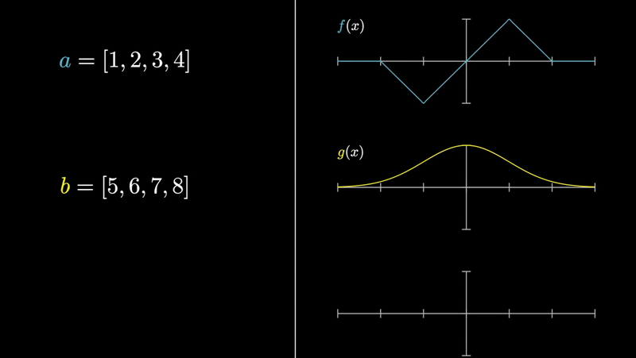
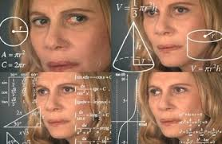
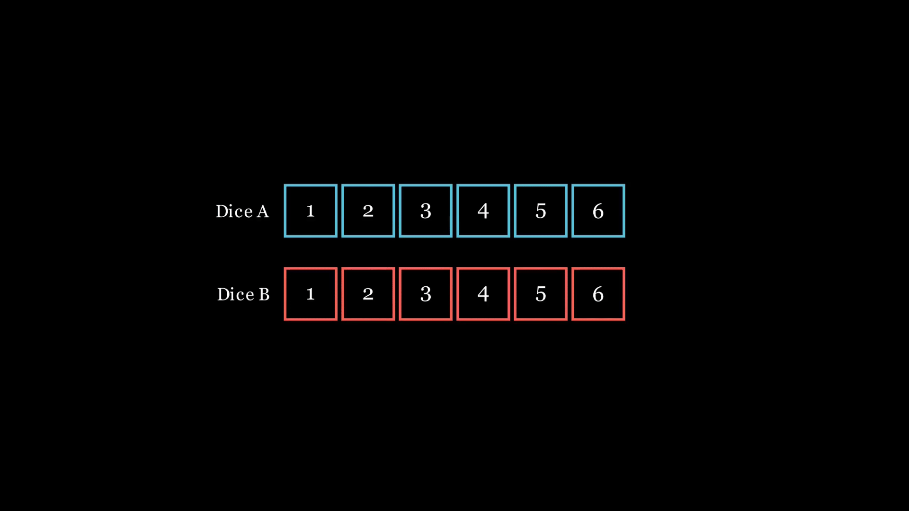
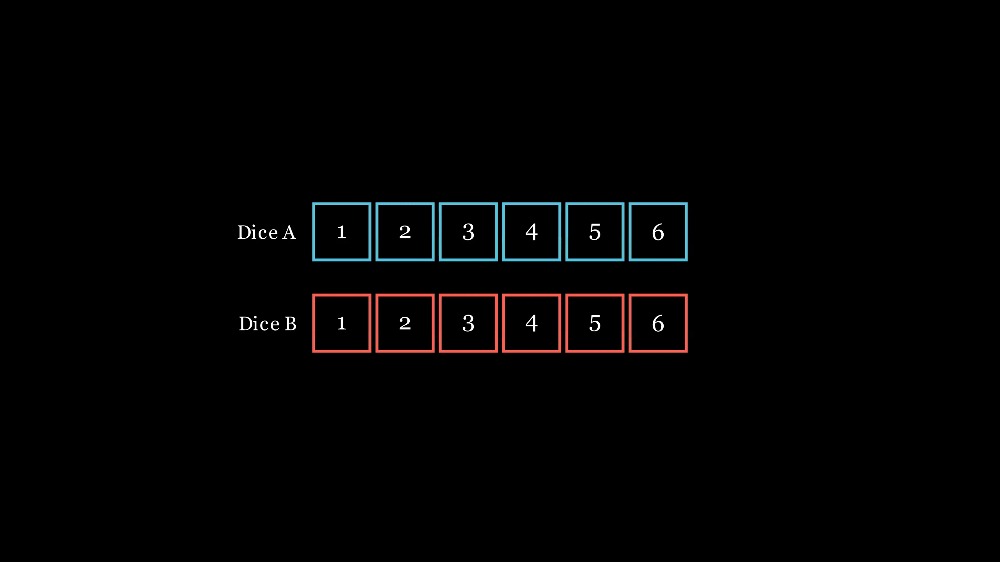
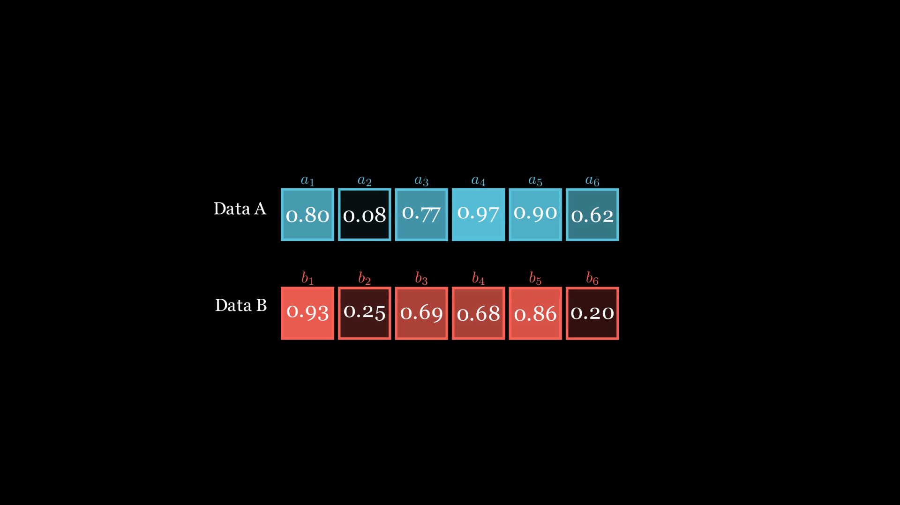
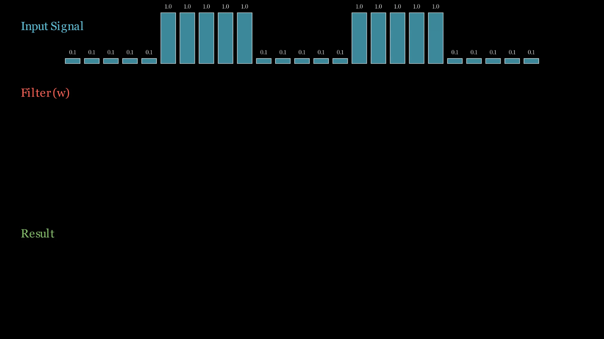
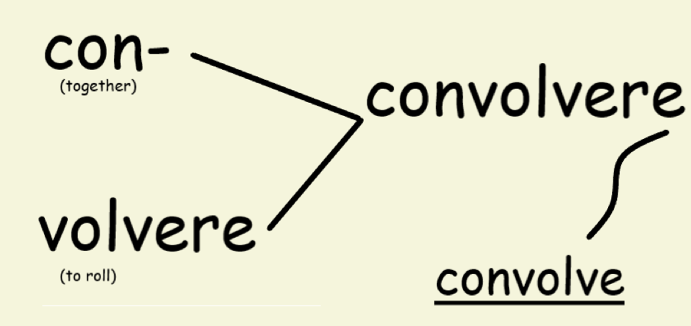
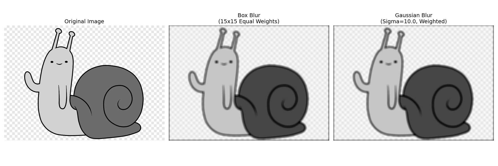

# Understanding Convolution: From Dice to Digital Signals

Convolution is a fundamental mathematical operation used to combine two signals, just like addition or multiplication. It serves as a building block in fields ranging from probability and statistics to computer vision and digital signal processing (DSP).

  

---

## 1. Convolution Formula

$$(f * g)(t) = \int_{-\infty}^{\infty} f(\tau)g(t - \tau) d\tau$$

- **$f(\tau)$** is the input signal or the function being transformed.
- **$g(t - \tau)$** is the "kernel" or filter. flipped and shifted by by $t$.
- **$(f * g)(t)$** Total area under the product as filter slides across the input signal at each $t$

**Ok but what is this? Does not make any sense whatsoever.**

  <!--  -->
  

---

## 2. Probabilistic Approach

Let's consider throwing a pair of dices. Calculating the probability for the sum of resulting throw being some number $n\in[1, 12]$ is fairly simple.

Considering a change in perspective greatly changes how we interpret the process of calculating this.

* **Reversing and Sliding**: $\text{Dice B Reversed}\rightarrow A[k], B[12-k], k\in [0, 12]$

  

* **Product**:
$$\text{for } n=12, \sum_{k=-\infty}^{\infty}a_k \cdot b_{n-k}$$

* **Weighting**:
  - Replace the dice weights with probabilities of outcome.
  - Tweak the formula to account for unknown number of outcome
  - For discrete case, it becomes: $A[k], B[n-k], \text{ and } k\in[-\infty, \infty]$

$$(A*B)(n)= \sum_{k=-\infty}^{\infty}A[n]\cdot B[n-k]$$

  

**We can just as easily see these ``dice faces`` as probabilities. The <ins>probability of any outcome</ins> $n$ will still be the same calculation.**

  

---

## 3. Sliding Window

In discrete systems, convolution is often visualized as a sliding window where a filter (kernel) moves across an input signal just like with the dice case.

**Example with weighted values:**

* **Input Signal**: `[0.1] * 5 + [1.0] * 5 + [0.1] * 5 + [1.0] * 5 + [0.1] * 5`.
* **Filter (Kernel)**: `[0.1, 0.2, 0.4, 0.2, 0.1]` (Notice the weights sum to 1.0).

**The Process:**

1. The filter is centered over a window of the input signal.
2. Each element of the filter is multiplied by the corresponding element of the input.
3. The results are summed to produce a single value in the output (Result) signal.
4. The window slides one step to the right, and the process repeats.

  

---

## Arbitrary Information
**brightness change to wake you up**

**Etymology**: The term comes from the Latin word "convolvere," which means "to roll together." This actually kind of  reflects the process of rolling one function over another to produce a new function. Much like how we visualize the sliding window in convolution.

  

## 4. Signal Processing (DSP)

In Digital Signal Processing, convolution is used to modify or extract features from signals. It is the primary tool for applying filters to audio, sensor data, and communication signals.

### 1D Signal Processing Examples

* **Low-Pass Filtering (Denoising)**: Using a kernel of equal weights (e.g., `np.ones(kernel_size) / kernel_size`) acts as a moving average. This "smooths" out high-frequency noise from a signal, such as a noisy `.wav` file. **[check low pass filter script](scripts/lowpassfilter.py)**

* **Echo Generation**: Convolution can simulate physical environments as well. By using a kernel with a '1' at the start (original sound) and smaller values at specific delays (e.g., `0.6` at 0.1s and `0.3` at 0.2s), you can create realistic multi-echo effects in audio.

  **$f[n] = \delta[n] + \alpha_1 \delta[n - d_1] + \alpha_2 \delta[n - d_2]$**
where **$\delta[n]$** is an impulse signal at $n=0$ (*kronecker delta*), it is concatenated with delayed versions of itself at **$n=d_1$** and **$n=d_2$** and **$f[n]$** is the filter. **[check echo script](scripts/echo.py)**

### 2D Spatial Filtering Examples
Convolution extends to two dimensions for image processing, where a 2D matrix (kernel) slides over the pixels of an image.
We will see how this process happens too but let us just check out some examples.

* **Vertical Kernel**: Highlights vertical edges, $A$ is input and $G_x$ is the output after convolution.

$$
G_x = \begin{bmatrix} 
-1 & 0 & 1 \\ 
-2 & 0 & 2 \\ 
-1 & 0 & 1 
\end{bmatrix} * A
$$

* **Horizontal Kernel**: Highlights horizontal edges, $A$ is input and $G_y$ is the output after convolution.

$$
G_y = \begin{bmatrix}
1 & 2 & 1 \\
0 & 0 & 0 \\
-1 & -2 & -1
\end{bmatrix} * A
$$

* **Edge Detection (Sobel Filter)**: Using specific kernels, you can calculate the gradient of image intensity. **[sobel filter script](scripts/sobel.py)**
  * Edge Magnitude ($G$) and Direction ($\theta$):

**$$G = \sqrt{G_x^2 + G_y^2} \qquad\qquad \theta = \arctan\left(\frac{G_y}{G_x}\right)$$**

* **Box Blur**: Uses a kernel of equal weights, considering size of the kernel to be $m \times n$:

$$
F = \frac{1}{m \cdot n} 
\begin{bmatrix}
1 & 1 & \dots & 1 \\ 
1 & 1 & \dots & 1 \\ 
\vdots & \vdots & \ddots & \vdots \\ 
1 & 1 & \dots & 1
\end{bmatrix}
$$
<!-- \end{bmatrix}}_{n \text{ rows}} -->

* **Gaussian Blur**: Uses a kernel based on a Gaussian distribution (weighted more toward the center), resulting in a more natural, smoother blur that preserves edges better than a box blur. **[image blurring script](scripts/blur.py)**

Sampled from:

**$$G(x, y) = \frac{1}{2\pi\sigma^2} e^{-\frac{x^2 + y^2}{2\sigma^2}}$$**

For a kernel of size **$m \times n$**, filter becomes:

**$$F_{i,j} = \frac{1}{2\pi\sigma^2} e^{-\frac{i^2 + j^2}{2\sigma^2}}, (i, j)\in [0, m-1] \times [0, n-1]$$**

**Don't forget to normalize, while applying a zero-sum operation (blurring), filter must sum to 1.**

**$$\text{Normalized } F_{i,j} = \frac{K_{i,j}}{\sum_{m} \sum_{n} K_{m,n}}$$**

**Output of blurring**

  

